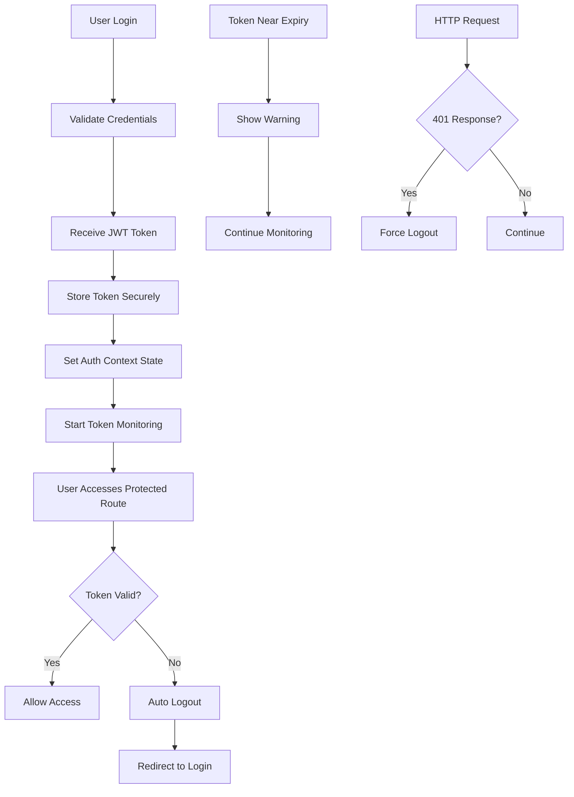

# Robust Authentication System Guide

## Overview

This application now implements a comprehensive, secure authentication system that automatically handles token expiration, provides centralized state management, and includes robust security features.

## Key Features

✅ **Automatic Token Validation**: JWT tokens are validated for format and expiration  
✅ **Automatic Logout on Expiration**: Users are automatically logged out when tokens expire  
✅ **Secure Token Storage**: Tokens stored in both localStorage and httpOnly cookies  
✅ **Centralized Auth State**: React Context for application-wide authentication state  
✅ **Route Protection**: Middleware and hooks for protecting routes  
✅ **Role-based Authorization**: Support for different user roles (student, delegate, company)  
✅ **Token Expiration Monitoring**: Real-time monitoring with early warnings  
✅ **Enhanced HTTP Interceptors**: Proper handling of 401 unauthorized responses  

## Authentication Flow



## Core Components

### 1. JWT Utils (`src/utils/jwtUtils.ts`)

Utility functions for JWT token handling:

```typescript
import { JwtUtils } from 'utils/jwtUtils';

// Check if token is expired
const isExpired = JwtUtils.isTokenExpired(token);

// Get token expiration time
const expiration = JwtUtils.getTokenExpiration(token);

// Validate token format
const isValid = JwtUtils.isValidTokenFormat(token);
```

### 2. Enhanced Auth Service (`src/services/auth.service.ts`)

Enhanced authentication service with comprehensive security features:

```typescript
import { _AuthService } from 'services/auth.service';

// Check authentication with validation
const isLoggedIn = _AuthService.isLoggedIn(); // Now validates token

// Force logout (used for expired tokens)
_AuthService.forceLogout('Token expired');

// Check if token will expire soon
const willExpire = _AuthService.willTokenExpireSoon(300); // 5 minutes
```

### 3. Authentication Context (`src/contexts/AuthContext.tsx`)

Central authentication state management:

```typescript
import { useAuth } from 'contexts/AuthContext';

function MyComponent() {
  const { 
    isAuthenticated, 
    isLoading, 
    user, 
    login, 
    logout,
    tokenExpiration,
    willExpireSoon 
  } = useAuth();
  
  return (
    <div>
      {isAuthenticated ? `Welcome ${user.name}` : 'Please login'}
      {willExpireSoon && <div>Session will expire soon!</div>}
    </div>
  );
}
```

### 4. Route Protection Hooks

Multiple hooks for different protection needs:

#### Basic Protection
```typescript
import { useProtectedRoute } from 'hooks/useProtectedRoute';

function ProtectedPage() {
  const { isLoading, isAuthorized } = useProtectedRoute({
    requireAuth: true,
    redirectTo: '/auth/login'
  });
  
  if (isLoading) return <div>Loading...</div>;
  if (!isAuthorized) return null; // Will redirect
  
  return <div>Protected content</div>;
}
```

#### Role-based Protection
```typescript
import { useAuthRequired } from 'hooks/useAuthRequired';

function AdminPanel() {
  const { isAuthenticated, hasRequiredRole } = useAuthRequired({
    requiredRoles: ['admin', 'delegate']
  });
  
  if (!isAuthenticated || !hasRequiredRole) return null;
  
  return <div>Admin content</div>;
}
```

#### Convenience Hooks
```typescript
import { useStudentAuth, useDelegateAuth } from 'hooks/useAuthRequired';

function StudentDashboard() {
  const { isLoading, user } = useStudentAuth();
  
  if (isLoading) return <div>Loading...</div>;
  
  return <div>Student Dashboard for {user.name}</div>;
}
```

#### Guest-only Pages
```typescript
import { useGuestOnly } from 'hooks/useProtectedRoute';

function LoginPage() {
  const { isLoading } = useGuestOnly(); // Redirects authenticated users
  
  if (isLoading) return <div>Loading...</div>;
  
  return <LoginForm />;
}
```

### 5. Enhanced HTTP Interceptors

Automatic handling of authentication errors:

- **401 Unauthorized**: Automatically logs out user and redirects to login
- **403 Forbidden**: Shows access denied message  
- **Token Refresh**: Future support for token refresh mechanism

### 6. Middleware Route Protection (`src/middleware.ts`)

Server-side route protection:

```typescript
// Protected routes (require authentication)
const protectedRoutes = [
  '/profile',
  '/courses',
  '/checkout',
  '/placement-test'
];

// Public routes (accessible to everyone)
const publicRoutes = [
  '/',
  '/contact-us',
  '/privacy-policy'
];

// Auth routes (redirect authenticated users)
const authRoutes = [
  '/auth/login',
  '/auth/signup'
];
```

## Usage Examples

### 1. Protecting a Page Component

```typescript
import { useAuthRequired } from 'hooks/useAuthRequired';

function CoursePage() {
  const { 
    isLoading, 
    isAuthenticated, 
    user,
    willExpireSoon 
  } = useAuthRequired({
    requiredRoles: ['student'],
    redirectTo: '/auth/login'
  });

  if (isLoading) {
    return <LoadingSpinner />;
  }

  return (
    <div>
      {willExpireSoon && (
        <Alert severity="warning">
          Your session will expire soon. Please save your work.
        </Alert>
      )}
      <h1>Welcome to the course, {user.name}!</h1>
    </div>
  );
}
```

### 2. Conditional Rendering Based on Auth State

```typescript
import { useAuth } from 'contexts/AuthContext';

function Header() {
  const { isAuthenticated, user, logout } = useAuth();

  return (
    <header>
      {isAuthenticated ? (
        <div>
          <span>Welcome, {user.name}</span>
          <button onClick={logout}>Logout</button>
        </div>
      ) : (
        <Link href="/auth/login">Login</Link>
      )}
    </header>
  );
}
```

### 3. Enhanced Login Implementation

```typescript
import { useAuth } from 'contexts/AuthContext';
import { useGuestOnly } from 'hooks/useProtectedRoute';

function LoginPage() {
  const { login } = useAuth();
  const { isLoading } = useGuestOnly(); // Redirects if already authenticated
  
  const handleLogin = async (credentials) => {
    try {
      const response = await _AuthService.login(credentials);
      const userData = {
        user: response.data.profile,
        token: response.data.token,
        role: ["student"]
      };
      
      // Use context login method
      login(userData.token, userData);
      
      // Handle redirect
      const returnUrl = router.query.returnUrl;
      router.push(returnUrl || '/dashboard');
      
    } catch (error) {
      console.error('Login failed:', error);
    }
  };

  if (isLoading) return <LoadingSpinner />;

  return <LoginForm onSubmit={handleLogin} />;
}
```

## Security Features

### 1. Token Validation

- **Format Validation**: Ensures JWT has proper structure (3 parts)
- **Expiration Check**: Validates `exp` claim against current time  
- **Automatic Cleanup**: Removes invalid/expired tokens

### 2. Secure Storage

- **localStorage**: For client-side access and backward compatibility
- **httpOnly Cookies**: Server-side only access, immune to XSS
- **Secure Flags**: HTTPS-only in production, SameSite protection

### 3. Automatic Monitoring

- **Real-time Validation**: Checks token every 30 seconds
- **Early Warning**: Alerts users 2 minutes before expiration
- **Graceful Degradation**: Handles network errors and edge cases

### 4. Route Protection

- **Middleware Level**: Server-side route protection
- **Component Level**: Client-side route guards
- **Role-based Access**: Fine-grained permission control

## Migration Guide

### From Legacy Auth System

1. **Update Component Imports**:
```typescript
// Old
import { useMe } from 'hooks/useMe';

// New (useMe still works but prefer useAuth)
import { useAuth } from 'contexts/AuthContext';
```

2. **Replace Manual Auth Checks**:
```typescript
// Old
const { isLogged, loading } = useMe();
if (loading) return <Loading />;
if (!isLogged) return <Unauthorized />;

// New
const { isLoading, isAuthenticated } = useAuthRequired();
if (isLoading) return <Loading />;
// Automatic redirect handled by hook
```

3. **Update Login Logic**:
```typescript
// Old
setMe(userData);
localStorage.setItem("user_data", JSON.stringify(userData));

// New  
login(token, userData); // Handles everything automatically
```

## Troubleshooting

### Common Issues

1. **Token Still Valid But User Logged Out**
   - Check browser console for token validation errors
   - Verify JWT secret hasn't changed on server
   - Clear localStorage and cookies, try fresh login

2. **User Not Redirected on Login**
   - Check `returnUrl` query parameter
   - Verify route is not in `authRoutes` in middleware
   - Check for JavaScript errors in browser console

3. **Infinite Loading State**
   - Verify `AuthProvider` wraps your app component
   - Check for circular dependencies in auth hooks
   - Ensure `_app.tsx` properly initialized

4. **Route Protection Not Working**
   - Check middleware configuration in `next.config.js`
   - Verify route patterns in `middleware.ts`
   - Ensure cookies are properly set

### Debug Tools

```typescript
// Debug authentication state
import { _AuthService } from 'services/auth.service';

// Check current auth status
console.log('Token exists:', _AuthService.hasToken());
console.log('Token valid:', _AuthService.isLoggedIn());
console.log('Token expiration:', _AuthService.getTokenExpiration());

// Debug localStorage state
_AuthService.debugLocalStorage();
```

## Best Practices

1. **Always Use Hooks**: Prefer `useAuth` and related hooks over direct service calls
2. **Handle Loading States**: Always show loading UI while auth state is being determined
3. **Graceful Degradation**: Handle auth failures gracefully with user-friendly messages
4. **Regular Testing**: Test token expiration scenarios in development
5. **Monitor Logs**: Watch for authentication-related errors in production logs

## Future Enhancements

- **Token Refresh**: Automatic token refresh before expiration
- **Multi-factor Authentication**: SMS/Email verification support
- **Session Management**: Active session monitoring and concurrent login control
- **Audit Logging**: Track authentication events for security monitoring

This authentication system provides enterprise-grade security while maintaining excellent developer experience. All existing components will continue to work while gaining the benefits of enhanced security and automatic token management. 